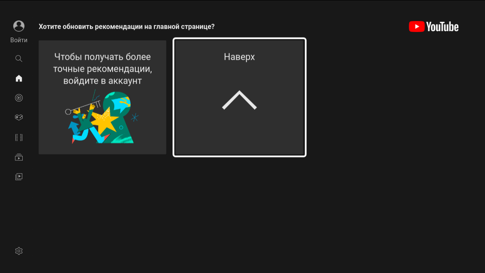

# LWTV-ui
a lightweight shell for working on smart TVs. LXTV-ui - Lightweight Wayland TV ui.
# Screenshots

# Functions
what works  | status |
| --- | --- |
| Debian | Y |
| Andorid | N |
| Ubuntu | Y |
| Windows | N |
| x86 | Y |
| aarch64 | Y |
| Raspberry Pi 3/4 | ? |
| Combitable AirMouse c120 | Y |
| Combitable Keyboard | P |
| Cobitable mouse | P |
| Web Addons | Y |
| HomeScreen | Y |
| PVR IPTV addon | Y |
| Youtube TV | Y |
| Settings App | P |
| Network Manager | N |
| Setup Wizard | P |
| English Language | Y |
| Russia Language | N |

# How Create your web Addon?
Web addons - this is web app on cdn js, html5, css5 optimized for big screen.  
1)you can implement a web application in html5 js css for large screens and put it in special packages  
2) After you have index.html and the application sources themselves, you can pack a special addon:  
    1)In the root of the web application, create a text file addon.conf;  
    2)fill in this file with these lines:  
        [app]  
        name=<addonName>  
        program=<addon type game or app>  
        author=<author name>  
        description=<desciption>  
        icon=<icon.png in root derictory>  
        type=0 <no edit>  
        scale=1 <default 1 no edit>  
        path=<addonName>/index.html  
     3) Create a zip archive of the adon content and give the name <addonName>  
 #Example addon
 https://github.com/Vin4ter/LWTV-ui/blob/main/test2.zip
